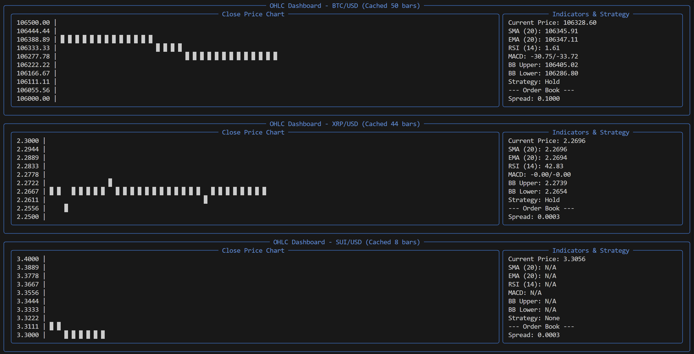

# PY-TRADER

## Description

Kraken real-time orderbook and OHLC data producer using Confluent Kafka.

This project is a Python-based producer that streams real-time orderbook and OHLC (Open, High, Low, Close) data from the Kraken exchange using Confluent Kafka. It utilizes the `confluent-kafka` library to produce messages to Kafka topics, which can be consumed by other applications or services for further processing or analysis.
It includes a Docker Compose setup to run Confluent Kafka locally, making it easy to test and develop without needing a full Kafka cluster.

## Features
- **Real-time Data**: Streams real-time orderbook and OHLC data from the Kraken exchange.
- **Confluent Kafka**: Uses Confluent Kafka for message production, ensuring high throughput and reliability.
- **Docker Compose**: Provides a simple way to set up and run Confluent Kafka locally.
- **Python**: Written in Python, making it easy to extend and integrate with other Python applications.
- **CLI**: Provides a command-line interface for easy interaction and testing.



## Install
```bash
python3 -m venv env
source env/bin/activate
```

### Run Confluent Kafka

```bash
docker-compose down
docker-compose up -d
docker ps
#open: http://localhost:9021
```

### Run Price Producer
```shell
python pricedata_producer.py
```
price:
```
2025-04-30 23:01:50,788 - INFO - Published OHLC data to ohlc_data_BTC_USD: {'instrument': 'BTC/USD', 'timestamp': '2025-04-30T22:05:00.000000Z', 'open': 94435.2, 'high': 94591.9, 'low': 94435.2, 'close': 94591.8, 'volume': 1.40669572, 'interval': 5}
```

### Run Orderbook Producer
```shell
python orderbook_producer.py
```


